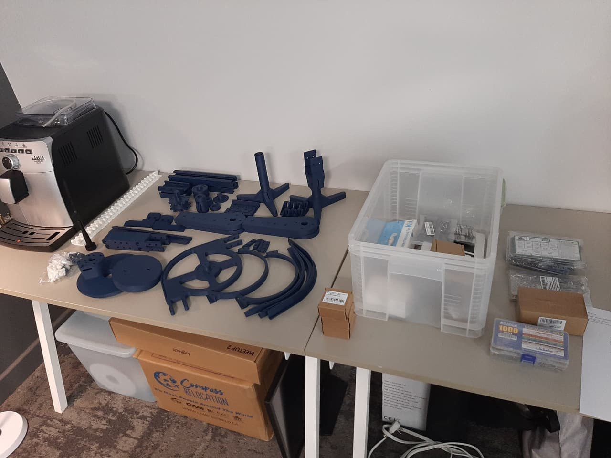
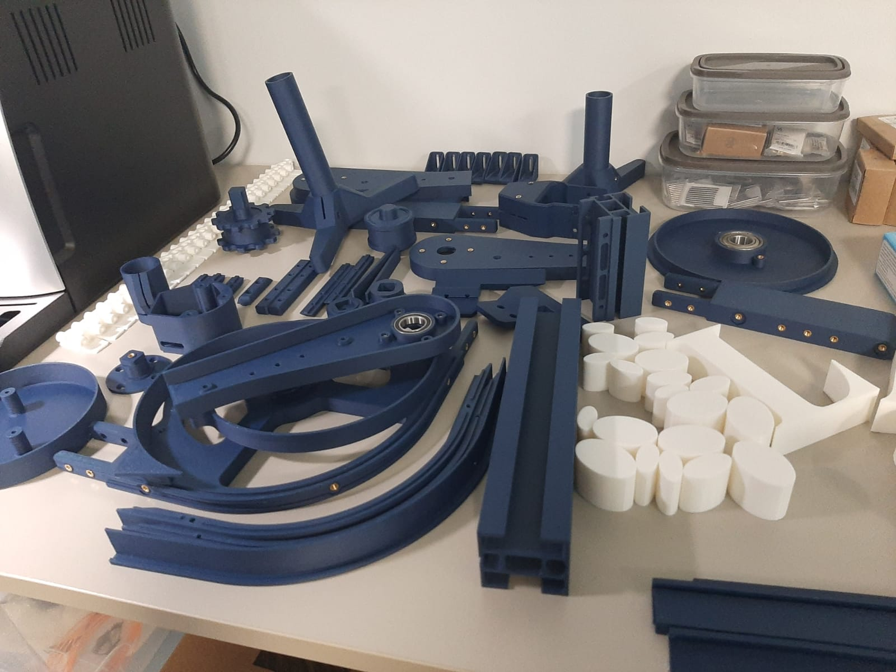
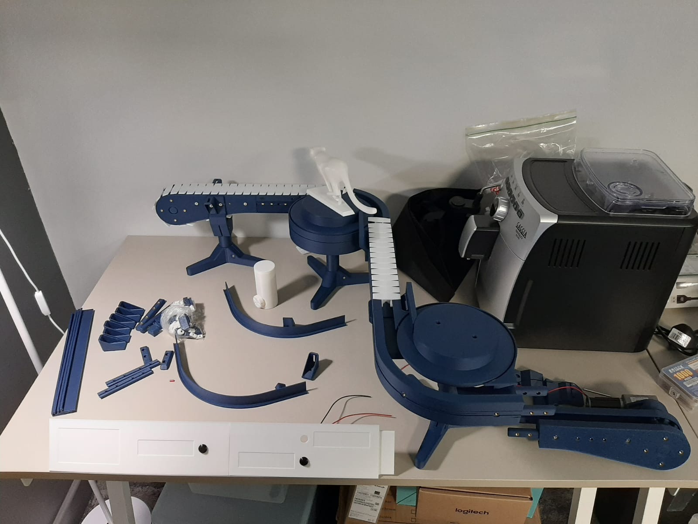
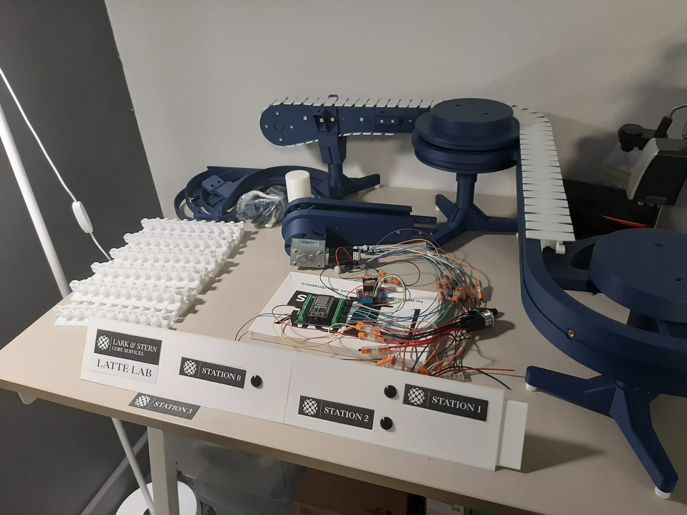

# Latte-Lab

A miniature conveyor belt system demonstrating the future of shopfloor automation. This project showcases a full-scale IIoT (Industrial Internet of Things) pipeline: from ESP32-driven physical motor control to real-time data visualization within SAP via MQTT and OPC-UA

## Visuals

<!-- - 
- 
-  -->

    

    

    

    

## Components Used

| Component                   | Description                                   | Purchase Link                                                   |
| :-------------------------- | :-------------------------------------------- | :-------------------------------------------------------------- |
| **ESP32 DevKit V1**         | Main microcontroller with WiFi/Bluetooth.     | [View on Amazon](https://www.amazon.com/s?k=esp32+devkit+v1)    |
| **L298N Motor Driver**      | Dual H-Bridge driver for DC motor control.    | [View on Amazon](https://www.amazon.com/s?k=L298N+motor+driver) |
| **DC Gear Motor**           | 6V-12V Motor for conveyor belt drive.         | [Insert link]()                                                 |
| **PIR Motion Sensors**      | Infrared sensors for motion/object detection. | [Insert link]()                                                 |
| **Industrial Push Buttons** | Manual override and start/stop controls.      | [Insert link]()                                                 |

## Installation Manual

- [Full Installation Manual](./INSTALLATION.md)

## Wiring & Grounding Tips

Correct grounding is critical to prevent ESP32 "brownouts" or sensor interference.

> **Crucial Note:** Ensure the ESP32 Ground and the Motor Power Supply Ground are connected (Common Ground).

### Wire Color Standards used in Latte Lab:

| Type           | Colors (In order of priority) |
| :------------- | :---------------------------- |
| **Ground**     | Black, Brown, Purple          |
| **VCC (3.3V)** | Red, Orange, White            |
| **Functions**  | Yellow, Blue, Green           |

_Note: Button wiring is pre-configured where Red is Power and Black is Ground._

### Master Push Button Wiring

| Button Pin Name | Position on Button |       COnnected to       | Wire Colour      |
| :-------------: | :----------------: | :----------------------: | ---------------- |
|     IN NO1      |     (Top left)     | Connect to the 3.3V pin  | Red -> White     |
|     NO NO1      |   (Bottom left)    | Connect to ESP32 Pin D25 | Red -> Blue      |
|     IN NO2      |    (Top right)     | Connect to ESP32 Pin D13 | Black -> Yellow  |
|     NO NO2      |   (Bottom Right)   |      Not Connected       | Black -> Nothing |

## Resource Links

- [t0nyz - Bambu Conveyor for EPS32](https://t0nyz.com/projects/year-2025/bambuconveyor)
- [t0nyz - github.com/t0nyz0/Bambu-Poop-Conveyor-ESP32](https://github.com/t0nyz0/Bambu-Poop-Conveyor-ESP32)
- [t0nyz - makerworld Bambu Poop Conveyor](https://makerworld.com/en/models/1071359-bambu-poop-conveyor-version-2-esp32-housing?from=search#profileId-1063585)
- [Modular Conveyor System](<./docs/Flexible%20chain,%20modular%20conveyor%20system-KE%2050-Version%202%20(1)%20(1).pdf>)
- [Chain assembly instruction](https://youtu.be/eQdI4LxynlE)
- [Chain installation instruction](https://youtu.be/QmK309wBs9c)
